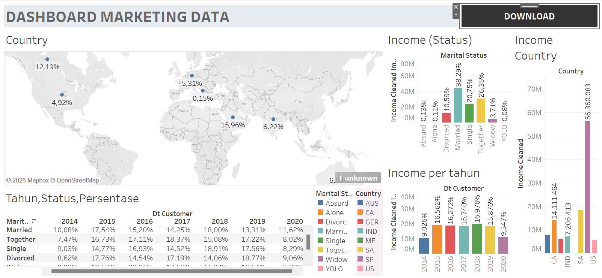

# Marketing-Campaign-Analysis-Dashboard
Interactive Tableau dashboard analyzing marketing campaign performance to uncover customer insights, income distribution, and data-driven business recommendations.
# 📊 Marketing Campaign Analysis Dashboard



## 📌 Project Overview

This project presents an interactive Tableau dashboard designed to analyze marketing campaign performance using customer demographic and purchasing data. The dashboard helps transform raw marketing data into meaningful insights that support data-driven business decisions.

Through various visualizations, users can identify customer income distribution, compare performance across countries, analyze customer segments, and evaluate trends that may influence future marketing strategies.

---

## 🎯 Business Problem

Marketing teams often collect large amounts of customer data but struggle to convert it into actionable insights.

This project aims to answer several important business questions:

- Which countries contribute the highest customer income?
- Which customer segments generate the most revenue?
- How does customer income change over time?
- Which customer groups should become the focus of future marketing campaigns?

---

## 🎯 Objectives

The main objectives of this project are:

- Analyze customer income distribution.
- Compare customer income across countries.
- Analyze customer demographics based on marital status.
- Monitor yearly income trends.
- Build an interactive dashboard for business decision-making.
- Provide business insights and recommendations based on data.

---

## 📂 Dataset

The dataset contains customer demographic and marketing campaign information.

Some important attributes include:

- Customer ID
- Country
- Income
- Marital Status
- Education
- Customer Registration Date
- Campaign Response
- Product Purchases
- Customer Complaints

---

## 🛠️ Tools Used

- Tableau Public
- Microsoft Excel

---

## 📊 Dashboard Features

The dashboard includes:

- 🌍 Customer Income by Country (Map)
- 📈 Income by Country
- 👨‍👩‍👧 Income by Marital Status
- 📅 Income Trend by Year
- 📋 Income Distribution Table
- 🎛 Interactive Filters

---

## 📸 Dashboard Preview


---

## 💡 Key Business Insights

From the dashboard analysis, several important insights can be identified:

- The United States contributes the highest customer income among all countries represented in the dataset.
- Married customers generate the largest portion of total customer income.
- Customer income varies significantly between countries, indicating differences in purchasing power.
- Income trends fluctuate over time, providing valuable information for evaluating marketing performance.
- Customer demographic analysis helps identify potential target markets for future campaigns.

---

## 📈 Business Recommendations

Based on the analysis, several recommendations can be proposed:

- Focus marketing campaigns on high-income customer segments.
- Increase marketing investment in countries with higher purchasing power.
- Develop personalized campaigns based on customer demographics.
- Continuously monitor customer income trends to improve future marketing strategies.
- Optimize campaign targeting using customer segmentation insights.

---

## 📚 Skills Demonstrated

This project demonstrates practical skills in:

- Data Visualization
- Dashboard Development
- Business Intelligence
- Data Storytelling
- Business Analysis
- Tableau Dashboard Design

---

## 📁 Repository Structure

```
Marketing-Campaign-Analysis-Dashboard
│
├── Dataset
│   └── marketing_data.xlsx
│
├── Images
│   └── dashboard.png
│
├── Tableau
│   └── Marketing Campaign Dashboard.twbx
│
├── README.md
│
└── LICENSE
```

---

## 🚀 Future Improvements

Possible future enhancements include:

- Connect the dashboard to a live SQL Server database.
- Build predictive analytics models using Python.
- Add customer segmentation and clustering analysis.
- Develop executive dashboards with additional KPIs.

---

## 👨‍💻 Author

**Gilang Permana Putra**

Aspiring Data Analyst

Skills:
- SQL
- Tableau
- Python
- Machine Learning

GitHub:
https://github.com/USERNAME

LinkedIn:
https://linkedin.com/in/USERNAME
